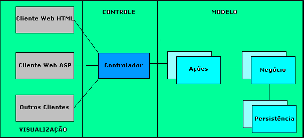

# Estudos JAVA

- Criar uma API utilizando SpringBoot 
- Utilizar [StackSpot](https://www.stackspot.com/pt/ai-pt) com sua GenAI para ajudar no desenvolvimento.


## 1. Criar API utilizando SpringBoot

[Spring Boot](https://spring.io/projects/spring-boot)

[Spring Framework: Unraveling the @Service Annotation](https://medium.com/@AlexanderObregon/spring-framework-unraveling-the-service-annotation-363f7d1e55e6)

Vamos criar uma API para cadastro (CRUD) de guitaras utilizando o padrão [MVC](https://www.devmedia.com.br/padrao-mvc-java-magazine/21995).

- Controller: O controlador é o componente que lida com as solicitações HTTP feitas pelos clientes e coordena as outras camadas da aplicação para gerar uma resposta apropriada. Ele atua como um intermediário entre a camada de visão e a camada de modelo, processando as entradas do usuário e determinando qual ação deve ser tomada para atendê-las. O controlador geralmente é implementado como uma classe Java anotada com @RestController no Spring MVC.

- Model: O modelo é a camada de negócios da aplicação que contém a lógica de negócios e os dados da aplicação. O modelo geralmente é implementado como uma classe Java simples e anotada com @Entity no Spring Data JPA indicando que é uma entidade JPA, mas pode incluir outras classes auxiliares e serviços. A camada de modelo interage com o banco de dados (ou outro meio de armazenamento) para recuperar, atualizar e persistir os dados. Ele também executa a validação e outras operações de lógica de negócios necessárias para gerar uma resposta apropriada.

- Repository: O repositório é a camada de persistência da aplicação que fornece uma interface para acessar e manipular os dados. Ele abstrai a complexidade da comunicação com o banco de dados e fornece uma API de alto nível para o modelo interagir com o banco de dados. O repositório geralmente é implementado como uma interface Java que define os métodos de acesso ao banco de dados.

- Service: O serviço é a camada que contém a lógica de negócios da aplicação. Ele fornece uma interface para a camada de controle interagir com a camada de modelo. O serviço geralmente é implementado como uma classe Java e é anotada com @Service no Spring, nela contém a lógica de negócios e os métodos que manipulam os dados. O serviço pode chamar métodos do repositório para persistir ou recuperar dados, bem como executar outras operações de lógica de negócios necessárias.

Esses quatro componentes trabalham juntos para fornecer uma API RESTful bem projetada e escalável. O controlador lida com as solicitações HTTP, interagindo com o serviço para realizar operações de negócios e recuperar dados do modelo. O serviço usa o repositório para interagir com o banco de dados, e o modelo contém a lógica de negócios e os dados da aplicação. Juntos, esses componentes fornecem uma arquitetura limpa e bem organizada para a sua aplicação.



## API Guitarra

A Guitarra API é uma aplicação Java que permite aos usuários cadastrar informações sobre guitarras. Com esta API, os usuários podem adicionar detalhes como marca, modelo, ano de fabricação, tipo de madeira, entre outros.

**Endpoints**

**GET /api/list**

Retorna uma lista de todas as guitarras cadastradas.

**POST /api/guitars**

Cria uma nova entrada de guitarra. O corpo da solicitação deve conter um objeto JSON com os detalhes da guitarra.

```
{
    "nome": "PIA",
    "preco": 4000.0,
    "modelo": "JEM"
}

```

**GET api/guitars/{id}**

Retorna os detalhes de uma guitarra específica, onde {id} é o ID da guitarra.

**GET api/guitars/search/{nome}**

Retorna os detalhes de uma guitarra específica, onde {nome} é o Nome da guitarra.

**PUT api//guitars/{id}**

Atualiza os detalhes de uma guitarra específica. O corpo da solicitação deve ser semelhante ao da solicitação POST.

```
{
    "nome": "PIA",
    "preco": 4000.0,
    "modelo": "JEM"
}

```

**DELETE /api/guitars/{id}**

Remove uma guitarra específica.


## Mysql

[Referencia](https://hub.docker.com/_/mysql)

[Configure a DataSource](https://docs.spring.io/spring-boot/docs/current/reference/htmlsingle/#data.sql.datasource)

Vamos utilizar o Mysql como DB.

Para subir um container rodando o Mysql podemos executar o comando abaixo;

***OBS***: em nosso compose.yml do projeto ja esta incluso o Mysql.

```
docker run -d -p 3306:3306 \
--name db-01 \
--network dev \
-e MYSQL_ROOT_PASSWORD=rootpasswd \
-e MYSQL_DATABASE=db_guitar \
-e MYSQL_USER=app_user \
-e MYSQL_PASSWORD=apppasswd \
-e MYSQL_ROOT_PASSWORD=rootpasswd \
mysql:8.0
```

## Build

Nessa seção vou mostrar como podemos fazer o build do projeto;

[Referencia](https://anywhere.epam.com/en/blog/how-to-dockerize-spring-boot-application)

[DockerDocs](https://docs.docker.com/language/java/develop/)

[Main commands for Spring Boot with Maven](https://gustavopeiretti.com/spring-boot-with-maven-wrapper/)

[](https://medium.com/@satanjim/how-we-reduced-the-memory-consumption-of-spring-boot-application-over-40-for-the-development-c8a5813fac23)

[JVM Memory Settings in a Container Environment](https://www.atamanroman.dev/development/2019/09/11/usecontainersupport-to-the-rescue.html)

### Local

Para buildar a aplicação e executar pela sua IDE pode executar um dos comandos abaixo;

```
./mvnw clean install
```
ou
```
./mvnw spring-boot:run
```

Ira gerar o arquivo jemguitar-0.0.1.jar na pasta **target/** .

### Docker

Para buildar e executar a aplicação utilizando docker usamos o **Multi-Stage Dockerfile** (esta na raiz do projeto), que isra fazer os estagios;

- ***base*** -> Apartir de uma imagem base com o jdk copia os arquivos e diretorios necessarios para o build.
- ***build*** -> Apartir de estagio **base** executa o build da aplicação.
- ***production*** -> Apartir do estagio **build** é disponibilizado a execução da aplicação.

Para criar a imagem execute o comando abaixo;

```
docker build -t felipe3b/api-java-guitar:latest .
```

Para verificar a imagem digite o comando abaixo;

```
docker image ls
```
Com a imagem gerada execute o comando abaixo para rodar a imagem em um container;

***OBS: Lembrando que para aplicação subir o DB precisa estar em execução.***

```
docker run --rm -d \
--name api-java-guitar \
--network dev \
-p 8080:8080 felipe3b/api-java-guitar:latest
```

## Docker Compose

Outra alternativa para executar a aplicação é utilizar o **compose.yaml** (esta na raiz do projeto), dessa maneira os containers do DB, Aplicação e Observability são executados com um unico comando.

Para subir os serviços (containers);
```
docker-compose up -d
```

Para visualizar o status dos serviços (containers);
```
docker-compose ps
```

Para parar remover os serviços (containers);
```
docker-compose down
```

## Observability

Para observability vamos usar os seguintes stack/ferramentas abaixo;

***OBS***: em nosso compose.yml do projeto ja esta incluso a stack.

- [Spring Actuator](https://docs.spring.io/spring-boot/docs/current/reference/htmlsingle/#actuator) para disponibilizar metricas e saude da aplicação.

- [Prometheus](https://prometheus.io/) para coletar as metricas da aplicação.

- [Grafana](https://grafana.com/) para vizualizar em dashboars as metricas coletadas.

- [AlertManager](https://prometheus.io/docs/alerting/latest/alertmanager/) para enviar notificações ([Video Favricio Veronez](https://www.youtube.com/watch?v=kRISeJk9PeQ)) .


***terminar de assistir https://www.youtube.com/watch?v=K_EI1SxVQ5Q&t=508s e continuar apartir de 14:22 para criar o container do prometheus.***


Comando que podemos usar para executar o prometheus;
```
docker run \
-d -p 9090:9090 \
--name prometheus-dev \
--network dev \
-v ~/projetos/api-java-guitar/config/prometheus.yml:/etc/prometheus/prometheus.yml \
prom/prometheus
```

### Configurando coletas das métricas

***<Inserir descrição>***

### Criando dashboards no grafana

***<Inserir descrição>***

### Configurando alertas e notificação

***<Inserir descrição>***


